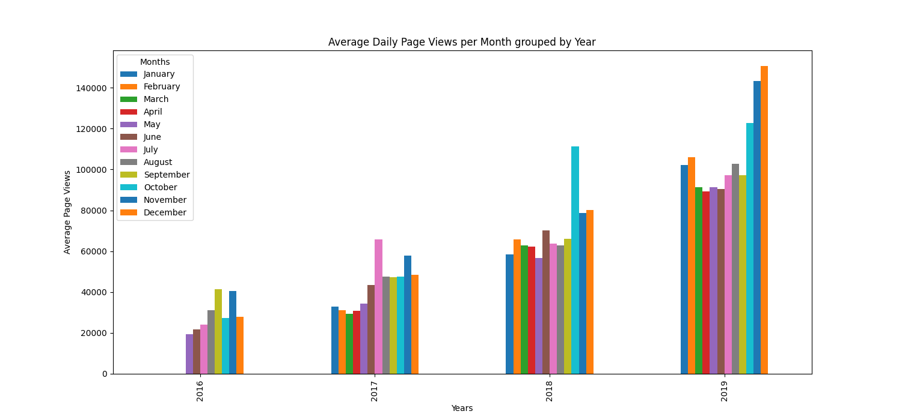
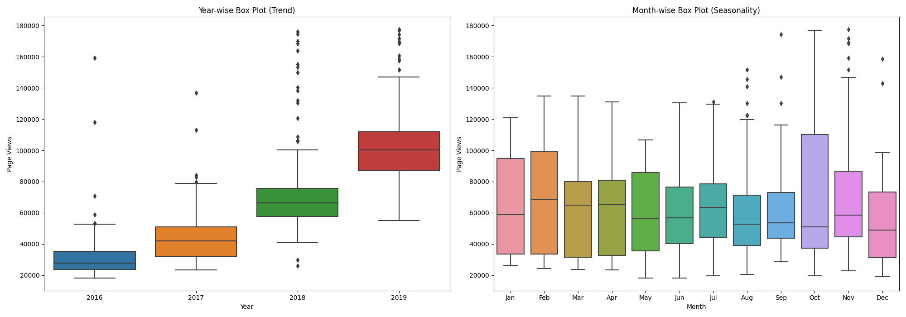

# Page View Time Series Visualizer

Here are some example visualizations generated by the project:

  
*Line Plot showing daily freeCodeCamp forum page views from May 2016 to December 2019.*

  
*Bar Plot showing average daily page views per month grouped by year.*

  
*Box Plots illustrating yearly trends and monthly seasonality in page views.*

---

## Project Overview

This project is a **Page View Time Series Visualizer** that analyzes and visualizes daily page views on the freeCodeCamp forum over several years. The dataset spans from May 2016 to December 2019, capturing user engagement patterns over time.

## What We Did

### Data Import & Cleaning  
- Imported the dataset (`fcc-forum-pageviews.csv`) using Pandas with the date column set as the index.  
- Cleaned the data by removing outliers — filtering out days where page views were in the top and bottom 2.5% to ensure accurate analysis.

### Visualization  

- **Line Plot:** Visualizes daily page views over the entire timeframe to highlight overall trends and fluctuations.  
- **Bar Plot:** Displays average daily page views per month grouped by year, revealing seasonal and annual patterns.  
- **Box Plot:** Shows the distribution of page views yearly and monthly to analyze trends and seasonality, highlighting variability and outliers.

## How We Worked

- Used **Pandas** for data handling and cleaning.  
- Used **Matplotlib** and **Seaborn** to create clear and informative visualizations.  
- Applied data filtering and transformations to prepare the dataset for meaningful visualization.  
- Developed functions to separately generate each type of plot, following project guidelines and tests.

## Purpose

This project helps understand temporal patterns in website traffic data by leveraging time series visualizations. It demonstrates practical skills in data cleaning, manipulation, and presentation using Python’s popular data science libraries.

---

This project is part of the freeCodeCamp Data Analysis with Python curriculum. For more details, visit:  
https://www.freecodecamp.org/learn/data-analysis-with-python/data-analysis-with-python-projects/page-view-time-series-visualizer
